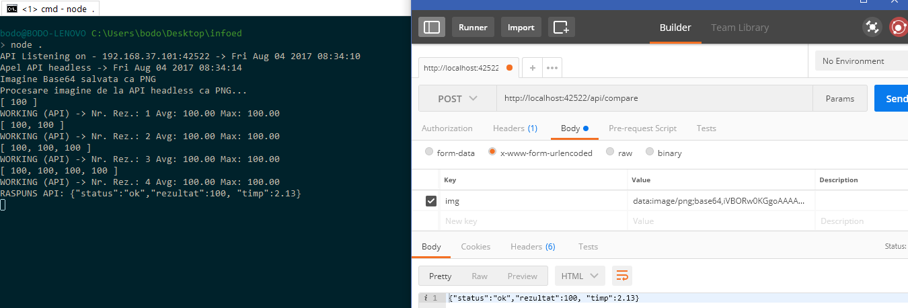
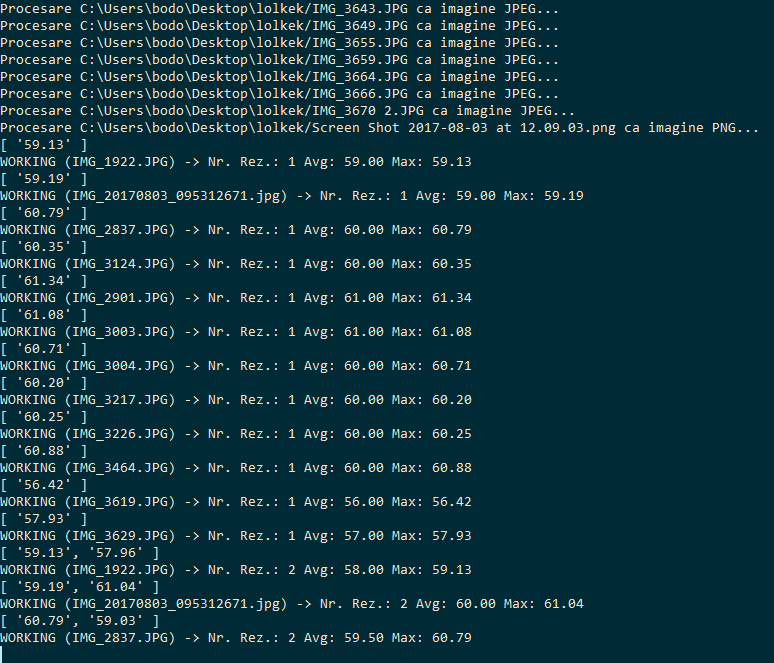
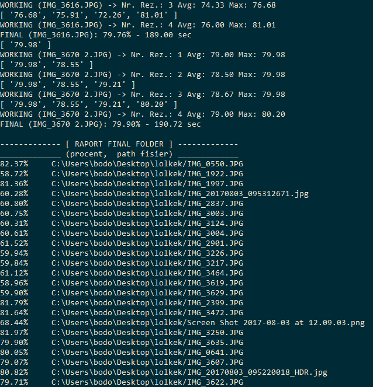
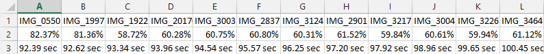
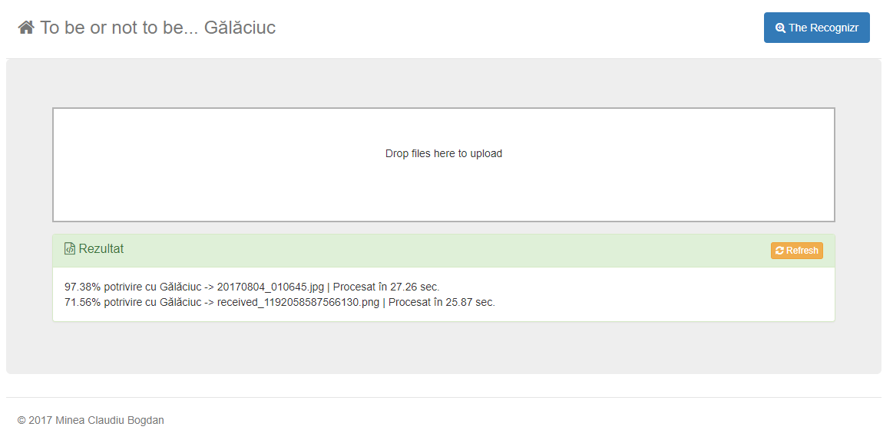

#### [InfoEducație 2017 - ediția 24 OPEN UTILITAR FINALA](https://infoeducatie.ro/): [Minea Claudiu Bogdan](http://community.infoeducatie.ro/t/transitkit-cloud-based-intelligent-transportation-system-utilitar-bucuresti-lucrari-2017-nationala/4406) :sleeping:
:computer: Poate că nu este cel mai avansat proiect, și sigur nici cel mai precis din punct de vedere al algoritmului, dar este așa-zisul „Shakespeare” de la Gălăciuc - TO BE OR NOT TO BE?!

O încercare de comparare vizuală pentru a confirma sau infirma probabilitatea ca una sau mai multe fotografii date, în command line (folder batch processing) sau pe o interfață web (responsive, ajax, socket) să fie făcute într-o locație dată, care are un set de poze sample date pentru extragerea și matching-ul informațiilor despre culoare, lightning, forme. Tehnologii Web, NodeJS, ResembleJS, Canvas. Alte funcții includ rezultate direct pe Web, batch upload, upload prin drag and drop sau direct de la cameră, folder batch processing în CLI, urmărirea progresului, două moduri de operare, raport CSV pentru fiecare evaluare făcută în CLI.  #hackathon

## Instalare și rulare 
Clonați aplicația din repository pe mașina locală și instalați dependințele de module. Este necesară o versiune recentă de NodeJS și NPM, disponibilă în variabila PATH a sistemului sau poate una portabilă.

`git clone https://github.com/BodoMinea/open2k17-izdisgalaciuk.git`

`npm install`

Există două moduri de a rula aplicația:

- Utilitar în linia de comandă: din folder-ul instalării rulăm `node . folderpoze` (de exemplu `node . C:\Users\bodo\Desktop\test`) sau `node index.js folderpoze`. Aplicația va procesa în mod multithreaded toate pozele din folder și va afișa la final rezultatele. Se salvează și un fișier CSV raport cu numele fișierelor evaluate, procentele și timpii de așteptare ce le corespund.

_Notă: există un al doilea parametru pentru rularea ca CLI tool, respectiv „modul” de operare. Implicit acesta este FAST. Se poate comuta în modul FULL care folosește sample-uri de rezoluție superioară (dar durează semnificativ mai mult) adăugând parametrul full (ex: `node . C:\Users\bodo\Desktop\test full`)_
- Ca serviciu Web. Rulăm aplicația fără niciun parametru: `node .` sau `node index.js`. În consolă se vor afișa IP-ul interfeței primare de rețea și portul de ascultare. By default, la adresa http://localhost:42522 este disponibilă o pagină web care comunică cu backend-ul și prin care se pot trimite imagini prin drag and drop, respectiv prin selectarea fișierelor sau deschiderea aplicației „Cameră” (pe telefon) pentru analiză.
- Serviciul web acceptă și call-uri API pe endpoint-ul /api/compare. Se așteaptă un parametru POST x-www-form-urlencoded care să conțină reprezentarea Base64 a unei imagini. Se returnează un răspuns de forma `{"status":"ok","rezultat":100, "timp":2.13}`

## Tehnologii folosite
- NodeJS (platforma de bază), Express (partea de web server), BodyParser (eventuali parametrii GET / API), busboy middleware (primire fișiere prin POST), fs-extra (funcții extinse de prelucrare a fișierelor)
- Socket.IO - pentru a trimite răspunsurile de la server către pagina client
- ResembleJS, Node Images - conversie de format, virtualizarea canvas-ului în linie de comandă, generarea unei imagini de „diferență” a mai multor imagini date). „Harta diferențelor” creată de ResembleJS, în funcție de care se poate calcula un oarecare grad de similitudine a celor două imagini, luând în calcul gama de culori, dispunerea acestora,  parametrii de luminozitate și anumite forme de obiecte. Anumiți parametrii de toleranță ai culorii, asupra antialiasing-ului au fost ajustate, împreună cu o formulă de calcul ponderat și o logică de împărțire și raportare a job-urilor din coadă au fost implementate în scopul realizării softului pe tema dată.
- Bonjour: anunțarea serviciului în LAN în vederea unei viitoare aplicații client.

* _Aplicația web este responsive și se poate adăuga ca web-app direct pe ecranul de start al telefonului (Android)_

### To-Do
- ~~RESTful JSON-API _(**poate**, dacă nu mai pică curentul și dacă mă mai trezesc)_~~ (implementat)
- Resemble V2 (?)
- Normalizarea dimensiunii imaginii odată cu conversia pentru a face comparația pe canvas mai precisă (?)
- Testări automatizate
- Metoda curentă de măsurare a timpului de procesare reușește cumva să măsoare timpul total, nu pe fiecare test. Se poate estima oricum timpul așteptat împărțind, dar o să investighez problema.

### Note
- Pentru a funcționa, aplicația are nevoie de cel puțin un set de date. În folderul res trebuie create două alte foldere `initset`, respectiv `lightset`, cel din urmă reprezentând fotografiile de referință pentru comparație la rezoluție mică (recomand [Caesium](https://saerasoft.com/caesium/) pentru redimensionări/compresie/conversie), iar primul pentru setul de fotografii la rezoluție completă. Formatul fișierelor de referință este obligatoriu **PNG**. Se pot folosi de exemplu chiar fotografiile din setul public furnizat de concurs: https://drive.google.com/open?id=0B8Cwvl0E-sEbMXluQ0ZXT2hIem8 (folderul cu pozitive pentru referință)
- Este necesară existența unui folder „upl” în `res` pentru a avea un spațiu dedicat încărcării fișierelor primite online.
- Comenzile sugerate la primul punct pot diferi de la sistem la sistem în funcție de instalare (ex.: `nodejs` în loc de `node` ca executabil implicit).
